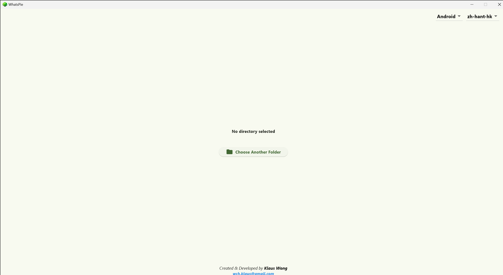
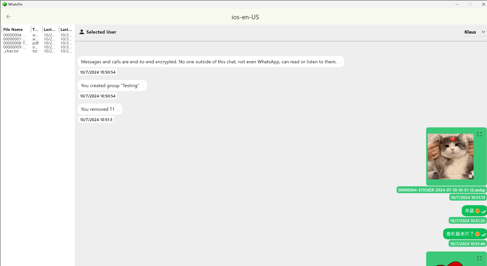
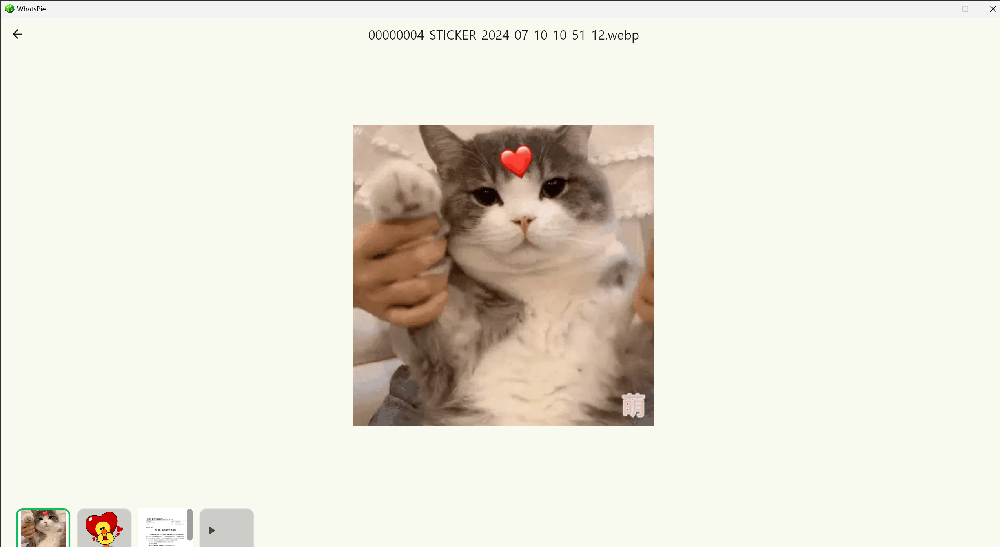

# WhatsPie

<p align="center">
     <a alt="Flutter">
        </a>
     <a alt="Dart">
        </a>
     <a alt="DevTools">
        </a>
     <a alt="VS Code">
        </a>
</p>


<p align="center">  </p>

<p align="center">
    
    
    
</p>

### WhatsPie is a cross-platform desktop application built using the Flutter framework. It allows you to preview your exported WhatsApp chat records on Windows, macOS, and Linux computers. In theory, this application is written in Flutter, but it is currently only tested and ready for Windows

## Testing Data
Please look at the testing_data folder for the testing data. Please find the corresponding platform with the locale folder and your corresponding testing settings. The folder naming should be in the format {platform}-{mobile_locale_name}.

## Limitations
Supports handling chat record exports from WhatsApp on Android and iOS with en-US or zh-Hant-HK mobile locales. Note that support for all languages may be limited, as the exported chat record display patterns can vary depending on the mobile platform and locale.

## Key Features
Import and display your exported WhatsApp chat records
```
# Support media files
- Media (.webp | .png | .jpeg | .jpg | .gif)
- Doc (.pdf)
- Voice (.opus)
- Vedio (.mp4)
```

## Support Chat Pattern
If you are interested, you should look at **WhatsAppRegex**. The Support Chat Pattern is based on the **Nokia C2 TA-1204 (Android Version: 9; WhatsApp Version: 2.24.13.77) for Android**, and on the **iPhone 13 Pro (iOS: 18.0; WhatsApp Version: 2.24.13.79) for iOS**. It currently only supports the **en-US** or **zh-hant-hk** locales.
#### For Android (en-US)
##### Pure Message Pattern on {file}.txt {Message sent by System}
```
# Pattern:  
# {dd}/{mm}/{yyyy}, {hh}/{mm} - {msg}

9/7/2021, 12:56 - 訊息和通話經端對端加密。此對話以外的任何人 (即使是 WhatsApp) 均無法查看或聆聽那些內容。⁠點按瞭解詳情。
```
##### Pure Message Pattern on {file}.txt (Message sent by Sender)
```
# Pattern:  
# {dd}/{mm}/{yyyy}, {hh}/{mm} - {sender}: {msg}

9/7/2021, 12:57 - Klaus: 請問是否有問題❓
```
##### Attachment Message Pattern on {file}.txt (Message sent by Sender)
```
# Pattern:  
# {dd}/{mm}/{yyyy}, {hh}/{mm} - {sender}: {attachment_file_name}.{attachment_type} (file attached)

10/7/2024 12:50, - Klaus: IMG-20240710-WA0000.jpg (file attached)
10/7/2024 12:51, - Klaus: VID-20240710-WA0003.mp4 (file attached)
10/7/2024 15:52, - Klaus: PTT-20240710-WA0007.opus (file attached)
```

#### For Android (zh-Hant-HK)
##### Pure Message Pattern on {file}.txt {Message sent by System}
```
# Pattern:  
# {dd}/{mm}/{yyyy} {hh}/{mm} - {msg}

9/7/2021 12:56 - 訊息和通話經端對端加密。此對話以外的任何人 (即使是 WhatsApp) 均無法查看或聆聽那些內容。⁠點按瞭解詳情。
```
##### Pure Message Pattern on {file}.txt (Message sent by Sender)
```
# Pattern:  
# {dd}/{mm}/{yyyy} {hh}/{mm} - {sender}: {msg}

9/7/2021 12:57 - Klaus: 請問是否有問題❓
```
##### Attachment Message Pattern on {file}.txt (Message sent by Sender)
```
# Pattern:  
# {dd}/{mm}/{yyyy} {hh}/{mm} - {sender}: {attachment_file_name}.{attachment_type} (附件檔案)

10/7/2024 12:50 - Klaus: IMG-20240710-WA0000.jpg (附件檔案)
10/7/2024 12:51 - Klaus: VID-20240710-WA0003.mp4 (附件檔案)
10/7/2024 15:52 - Klaus: PTT-20240710-WA0007.opus (附件檔案)
```

#### For iOS (en-US)
##### Pure Message Pattern on {file}.txt {Message sent by System - Grop Chat}
```
# Pattern:  
# [{dd}/{mm}/{yyyy}, {hh}/{mm}/{ss} {AM|PM}] {name_of_group}: {msg}

[10/7/2024, 9:50:00 AM] Testing: Messages and calls are end-to-end encrypted. No one outside of this chat, not even WhatsApp, can read or listen to them.
```
##### Pure Message Pattern on {file}.txt (Message sent by Sender)
```
# Pattern:  
# [{dd}/{mm}/{yyyy}, {hh}/{mm}/{ss} {AM|PM}] {sender}: {msg}

[10/7/2024, 9:50:00 AM] Klaus: 早晨!
```
##### Attachment Message Pattern on {file}.txt (Message sent by Sender)
```
# Pattern
# [{dd}/{mm}/{yyyy}, {hh}/{mm}/{ss} {AM|PM}] {sender}: <attached: {attachment_file_name}.{attachment_type}>

[10/7/2024, 9:50:00 AM] Klaus: <attached: 00000009-AUDIO-2024-07-09-10-54-15.opus>
[10/7/2024, 9:51:00 AM] Klaus: <attached: 00000007-STICKER-2024-07-09-10-52-47.webp>
```

#### For iOS (zh-Hant-HK)
##### Pure Message Pattern on {file}.txt {Message sent by System - Grop Chat}
```
# Pattern:  
# [{dd}/{mm}/{yyyy} {上午|下午}{hh}/{mm}/{ss}] {name_of_group}: {msg}

[28/5/2024 下午6:18:45] Testing: 訊息和通話經端對端加密。對話以外的任何人 (即使是 WhatsApp) 均無法查看或聆聽那些內容。
```
##### Pure Message Pattern on {file}.txt (Message sent by Sender)
```
# Pattern:
# [{dd}/{mm}/{yyyy} {上午|下午}{hh}/{mm}/{ss}] {sender}: {msg}

[10/7/2024 上午:50:00] Klaus: 早晨!
```
##### Attachment Message Pattern on {file}.txt (Message sent by Sender)
```
# Pattern
# [{dd}/{mm}/{yyyy} {上午|下午}{hh}/{mm}/{ss} {AM|PM}] {sender}:<附件：00000042: {attachment_file_name}.{attachment_type}>

[10/7/2024 下午1:38:12] Klaus:<附件：00000042-PHOTO-2024-07-10-13-38-12.jpg>
[10/7/2024 下午1:38:13] Klaus:<附件：00000009-AUDIO-2024-07-10-13-38-13.opus>
[10/7/2024 下午1:38:14] Klaus:<附件：00000007-STICKER-2024-07-10-13-38-14.webp>

```

## Application UIUX Preview





## How to export chat on Whatsapp
#### For Android
[Export WhatsApp chat on Android](https://faq.whatsapp.com/1180414079177245/?locale=en_US&cms_platform=android)
#### For iOS
[Export WhatsApp chat on iOS](https://faq.whatsapp.com/1180414079177245/?cms_platform=iphone&helpref=platform_switcher&locale=en_US)

## Getting Started
### Prerequisites
- [Flutter SDK](https://flutter.dev/docs/get-started/install) installed on your system
- Supported operating system: Windows, macOS, or Linux

### Installation

1. Clone the repository:

```
git clone https://github.com/wchklaus97/whats_pie.git
```

2. Change to the project directory:

```
cd WhatsPie
```

3. Install dependencies:

```
flutter pub get
dart run build_runner build
```

4. Build the application:

```
flutter build <platform>
```

Replace `<platform>` with `windows`, `macos`, or `linux` depending on your target operating system.

5. Run the application:

```
flutter run
```

## Contributing
```
WhatsPie is an open-source project, and we welcome contributions from the community. If you find any issues or have ideas for new features, please feel free to open an issue or submit a pull request.
```

## MIT License

```
Copyright (c) 2024 wchklaus97

Permission is hereby granted, free of charge, to any person obtaining a copy
of this software and associated documentation files (the "Software"), to deal
in the Software without restriction, including without limitation the rights
to use, copy, modify, merge, publish, distribute, sublicense, and/or sell
copies of the Software, and to permit persons to whom the Software is
furnished to do so, subject to the following conditions:

The above copyright notice and this permission notice shall be included in all
copies or substantial portions of the Software.

THE SOFTWARE IS PROVIDED "AS IS", WITHOUT WARRANTY OF ANY KIND, EXPRESS OR
IMPLIED, INCLUDING BUT NOT LIMITED TO THE WARRANTIES OF MERCHANTABILITY,
FITNESS FOR A PARTICULAR PURPOSE AND NONINFRINGEMENT. IN NO EVENT SHALL THE
AUTHORS OR COPYRIGHT HOLDERS BE LIABLE FOR ANY CLAIM, DAMAGES OR OTHER
LIABILITY, WHETHER IN AN ACTION OF CONTRACT, TORT OR OTHERWISE, ARISING FROM,
OUT OF OR IN CONNECTION WITH THE SOFTWARE OR THE USE OR OTHER DEALINGS IN THE
SOFTWARE.
```
